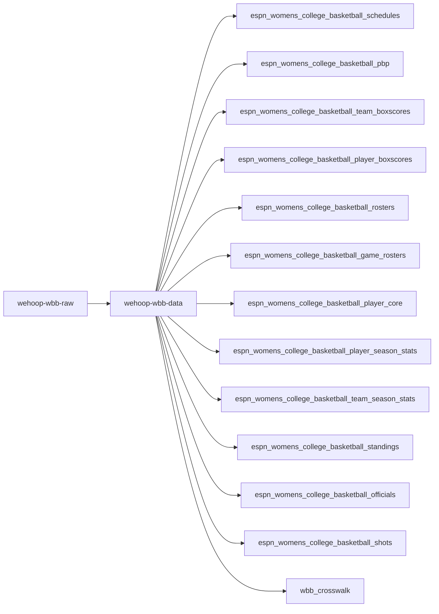
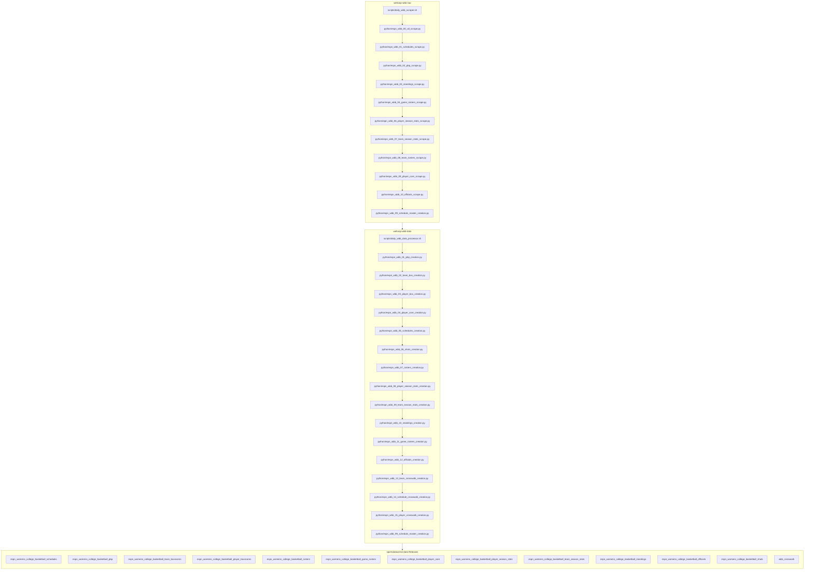

# wehoop-wbb-data

## wehoop ESPN WBB workflow diagram

`scripts/daily_wbb_scraper.sh` and `scripts/daily_wbb_data_processor.sh` are the
daily drivers (the `00` role); stage numbers are intended build order, not run order.
On the raw side `05` (draft) is WNBA-only and intentionally vacant;
`espn_wbb_00_all_scrape.py` sweeps every stage in one call.

[wehoop-wbb-raw repository (source: ESPN)](https://github.com/sportsdataverse/wehoop-wbb-raw)

[wehoop-wbb-data repository (source: ESPN)](https://github.com/sportsdataverse/wehoop-wbb-data)

[wehoop-wnba-raw repository (source: ESPN)](https://github.com/sportsdataverse/wehoop-wnba-raw)

[wehoop-wnba-data repository (source: ESPN)](https://github.com/sportsdataverse/wehoop-wnba-data)

[wehoop-wnba-stats-raw repository (source: WNBA Stats)](https://github.com/sportsdataverse/wehoop-wnba-stats-raw)

[wehoop-wnba-stats-data repository (source: WNBA Stats)](https://github.com/sportsdataverse/wehoop-wnba-stats-data)

[ncaa-wbb-hoops-raw repository (source: stats.ncaa.org)](https://github.com/sportsdataverse/ncaa-wbb-hoops-raw)

[ncaa-wbb-hoops-data repository (source: stats.ncaa.org)](https://github.com/sportsdataverse/ncaa-wbb-hoops-data)

## Women's Basketball Data Releases

[ESPN Women's College Basketball Schedules](https://github.com/sportsdataverse/sportsdataverse-data/releases/tag/espn_womens_college_basketball_schedules)

[ESPN Women's College Basketball PBP](https://github.com/sportsdataverse/sportsdataverse-data/releases/tag/espn_womens_college_basketball_pbp)

[ESPN Women's College Basketball Team Boxscores](https://github.com/sportsdataverse/sportsdataverse-data/releases/tag/espn_womens_college_basketball_team_boxscores)

[ESPN Women's College Basketball Player Boxscores](https://github.com/sportsdataverse/sportsdataverse-data/releases/tag/espn_womens_college_basketball_player_boxscores)

[ESPN WNBA Schedules](https://github.com/sportsdataverse/sportsdataverse-data/releases/tag/espn_wnba_schedules)

[ESPN WNBA PBP](https://github.com/sportsdataverse/sportsdataverse-data/releases/tag/espn_wnba_pbp)

[ESPN WNBA Team Boxscores](https://github.com/sportsdataverse/sportsdataverse-data/releases/tag/espn_wnba_team_boxscores)

[ESPN WNBA Player Boxscores](https://github.com/sportsdataverse/sportsdataverse-data/releases/tag/espn_wnba_player_boxscores)

## Data Repositories

[wehoop-wnba-raw data repository (source: ESPN)](https://github.com/sportsdataverse/wehoop-wnba-raw)

[wehoop-wnba-data repository (source: ESPN)](https://github.com/sportsdataverse/wehoop-wnba-data)

[wehoop-wnba-stats-data Repo (source: NBA Stats)](https://github.com/sportsdataverse/wehoop-wnba-stats-data)

[wehoop-wbb-raw data repository (source: ESPN)](https://github.com/sportsdataverse/wehoop-wbb-raw)

[wehoop-wbb-data repository (source: ESPN)](https://github.com/sportsdataverse/wehoop-wbb-data)

## Datasets

<!-- BEGIN GENERATED: datasets -->
| Script | Dataset | Release tag | Last published |
|---|---|---|---|
| [`python/espn_wbb_01_pbp_creation.py`](python/espn_wbb_01_pbp_creation.py) | [`pbp`](docs/datasets/pbp.md) | [`espn_womens_college_basketball_pbp`](https://github.com/sportsdataverse/sportsdataverse-data/releases/tag/espn_womens_college_basketball_pbp) | 2026-08-24 |
| [`python/espn_wbb_02_team_box_creation.py`](python/espn_wbb_02_team_box_creation.py) | [`team_box`](docs/datasets/team_box.md) | [`espn_womens_college_basketball_team_boxscores`](https://github.com/sportsdataverse/sportsdataverse-data/releases/tag/espn_womens_college_basketball_team_boxscores) | 2026-08-24 |
| [`python/espn_wbb_03_player_box_creation.py`](python/espn_wbb_03_player_box_creation.py) | [`player_box`](docs/datasets/player_box.md) | [`espn_womens_college_basketball_player_boxscores`](https://github.com/sportsdataverse/sportsdataverse-data/releases/tag/espn_womens_college_basketball_player_boxscores) | 2026-08-24 |
| [`python/espn_wbb_04_player_core_creation.py`](python/espn_wbb_04_player_core_creation.py) | [`player_core`](docs/datasets/player_core.md) | [`espn_womens_college_basketball_player_core`](https://github.com/sportsdataverse/sportsdataverse-data/releases/tag/espn_womens_college_basketball_player_core) | 2026-08-24 |
| [`python/espn_wbb_05_schedules_creation.py`](python/espn_wbb_05_schedules_creation.py) | [`schedules`](docs/datasets/schedules.md) | [`espn_womens_college_basketball_schedules`](https://github.com/sportsdataverse/sportsdataverse-data/releases/tag/espn_womens_college_basketball_schedules) | 2026-07-17 |
| [`python/espn_wbb_06_shots_creation.py`](python/espn_wbb_06_shots_creation.py) | [`shots`](docs/datasets/shots.md) | [`espn_womens_college_basketball_shots`](https://github.com/sportsdataverse/sportsdataverse-data/releases/tag/espn_womens_college_basketball_shots) | 2026-08-24 |
| [`python/espn_wbb_07_rosters_creation.py`](python/espn_wbb_07_rosters_creation.py) | [`rosters`](docs/datasets/rosters.md) | [`espn_womens_college_basketball_rosters`](https://github.com/sportsdataverse/sportsdataverse-data/releases/tag/espn_womens_college_basketball_rosters) | 2026-08-24 |
| [`python/espn_wbb_08_player_season_stats_creation.py`](python/espn_wbb_08_player_season_stats_creation.py) | [`player_season_stats`](docs/datasets/player_season_stats.md) | [`espn_womens_college_basketball_player_season_stats`](https://github.com/sportsdataverse/sportsdataverse-data/releases/tag/espn_womens_college_basketball_player_season_stats) | 2026-08-24 |
| [`python/espn_wbb_09_team_season_stats_creation.py`](python/espn_wbb_09_team_season_stats_creation.py) | [`team_season_stats`](docs/datasets/team_season_stats.md) | [`espn_womens_college_basketball_team_season_stats`](https://github.com/sportsdataverse/sportsdataverse-data/releases/tag/espn_womens_college_basketball_team_season_stats) | 2026-08-24 |
| [`python/espn_wbb_10_standings_creation.py`](python/espn_wbb_10_standings_creation.py) | [`standings`](docs/datasets/standings.md) | [`espn_womens_college_basketball_standings`](https://github.com/sportsdataverse/sportsdataverse-data/releases/tag/espn_womens_college_basketball_standings) | 2026-08-24 |
| [`python/espn_wbb_11_game_rosters_creation.py`](python/espn_wbb_11_game_rosters_creation.py) | [`game_rosters`](docs/datasets/game_rosters.md) | [`espn_womens_college_basketball_game_rosters`](https://github.com/sportsdataverse/sportsdataverse-data/releases/tag/espn_womens_college_basketball_game_rosters) | 2026-08-24 |
| [`python/espn_wbb_12_officials_creation.py`](python/espn_wbb_12_officials_creation.py) | [`officials`](docs/datasets/officials.md) | [`espn_womens_college_basketball_officials`](https://github.com/sportsdataverse/sportsdataverse-data/releases/tag/espn_womens_college_basketball_officials) | 2026-08-24 |
| [`python/espn_wbb_13_team_crosswalk_creation.py`](python/espn_wbb_13_team_crosswalk_creation.py) | [`team_crosswalk`](docs/datasets/team_crosswalk.md) | [`wbb_crosswalk`](https://github.com/sportsdataverse/sportsdataverse-data/releases/tag/wbb_crosswalk) | 2026-07-17 |
| [`python/espn_wbb_14_schedule_crosswalk_creation.py`](python/espn_wbb_14_schedule_crosswalk_creation.py) | [`schedule_crosswalk`](docs/datasets/schedule_crosswalk.md) | [`wbb_crosswalk`](https://github.com/sportsdataverse/sportsdataverse-data/releases/tag/wbb_crosswalk) | 2026-07-17 |
| [`python/espn_wbb_15_player_crosswalk_creation.py`](python/espn_wbb_15_player_crosswalk_creation.py) | [`player_crosswalk`](docs/datasets/player_crosswalk.md) | [`wbb_crosswalk`](https://github.com/sportsdataverse/sportsdataverse-data/releases/tag/wbb_crosswalk) | 2026-07-17 |
<!-- END GENERATED: datasets -->

## Reports & explainers

<!-- BEGIN GENERATED: reports -->

| Report | What it is | Last updated |
|---|---|---|
| [Dataset docs (column-level, generated)](docs/datasets/) | 15 files, one per item | 2026-08-24 |

<!-- END GENERATED: reports -->

## Automation & status

<!-- BEGIN GENERATED: status -->

| workflow | schedule | last run |
|---|---|---|
|  | days 18-31 07:00 UTC in Oct; daily 07:00 UTC in Nov-Dec; daily 07:00 UTC in Jan-Mar; days 1-12 07:00 UTC in Apr | 2026-08-24 |
|  | on push / PR / dispatch | 2026-08-27 |
|  | on push / PR / dispatch | 2026-08-27 |
|  | daily 13:00 UTC in Nov-Dec; daily 13:00 UTC in Jan-Apr | never run |
|  | Mondays 12:00 UTC | 2026-08-31 |
|  | Sundays 06:00 UTC | 2026-08-30 |

| release tag | assets | size | last publish |
|---|---:|---:|---|
| [`espn_womens_college_basketball_schedules`](https://github.com/sportsdataverse/sportsdataverse-data/releases/tag/espn_womens_college_basketball_schedules) | 85 | 408.2 MB | 2026-07-17 |
| [`espn_womens_college_basketball_pbp`](https://github.com/sportsdataverse/sportsdataverse-data/releases/tag/espn_womens_college_basketball_pbp) | 73 | 8,532.8 MB | 2026-08-24 |
| [`espn_womens_college_basketball_team_boxscores`](https://github.com/sportsdataverse/sportsdataverse-data/releases/tag/espn_womens_college_basketball_team_boxscores) | 72 | 77.5 MB | 2026-08-24 |
| [`espn_womens_college_basketball_player_boxscores`](https://github.com/sportsdataverse/sportsdataverse-data/releases/tag/espn_womens_college_basketball_player_boxscores) | 72 | 956.8 MB | 2026-08-24 |
| [`espn_womens_college_basketball_rosters`](https://github.com/sportsdataverse/sportsdataverse-data/releases/tag/espn_womens_college_basketball_rosters) | 11 | 8.2 MB | 2026-08-30 |
| [`espn_womens_college_basketball_game_rosters`](https://github.com/sportsdataverse/sportsdataverse-data/releases/tag/espn_womens_college_basketball_game_rosters) | 71 | 541.4 MB | 2026-08-24 |
| [`espn_womens_college_basketball_player_core`](https://github.com/sportsdataverse/sportsdataverse-data/releases/tag/espn_womens_college_basketball_player_core) | 66 | 39.7 MB | 2026-08-24 |
| [`espn_womens_college_basketball_player_season_stats`](https://github.com/sportsdataverse/sportsdataverse-data/releases/tag/espn_womens_college_basketball_player_season_stats) | 61 | 95.2 MB | 2026-08-24 |
| [`espn_womens_college_basketball_team_season_stats`](https://github.com/sportsdataverse/sportsdataverse-data/releases/tag/espn_womens_college_basketball_team_season_stats) | 49 | 56.7 MB | 2026-08-24 |
| [`espn_womens_college_basketball_standings`](https://github.com/sportsdataverse/sportsdataverse-data/releases/tag/espn_womens_college_basketball_standings) | 68 | 139.6 MB | 2026-08-24 |
| [`espn_womens_college_basketball_officials`](https://github.com/sportsdataverse/sportsdataverse-data/releases/tag/espn_womens_college_basketball_officials) | 37 | 10.4 MB | 2026-08-24 |
| [`espn_womens_college_basketball_shots`](https://github.com/sportsdataverse/sportsdataverse-data/releases/tag/espn_womens_college_basketball_shots) | 74 | 1,019.4 MB | 2026-08-24 |
| [`wbb_crosswalk`](https://github.com/sportsdataverse/sportsdataverse-data/releases/tag/wbb_crosswalk) | 79 | 12.2 MB | 2026-07-17 |

<!-- END GENERATED: status -->
