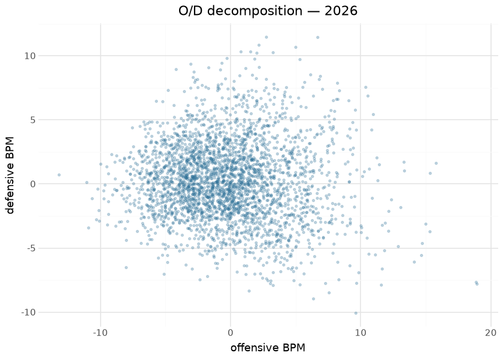
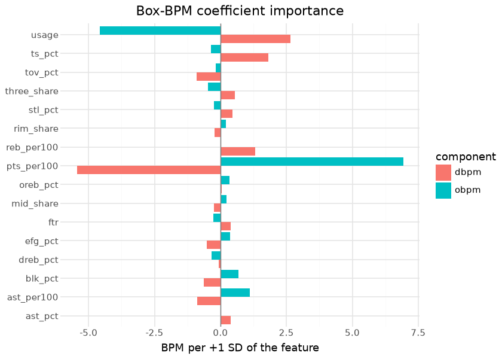

# WBB player value — box Plus/Minus

Per-player box Plus/Minus publishes on the `wbb_player_value` tag
(`box_obpm` / `box_dbpm` / `box_bpm`): a box-score value model over the
published player/team season stats, sharing the design of the WBB
player-value spine in sdv-py (oracle-gated where trained). Per-100 box
features are standardized and scored through ridge coefficients fit at
the team level, then a uniform team adjustment makes each team’s
minutes-weighted player scores sum to its adjusted efficiency margin;
offensive and defensive components are estimated separately and summed.
It is compute-on-demand — every run recomputes from the current
published season assets, so a data correction upstream flows through on
the next publish, and each publish writes a card sidecar plus the fitted
coefficient vector.

Box Plus/Minus and on/off RAPM (the `ncaa_wbb_rapm` model in the NCAA
hoops repos) deliberately measure different things: BPM sees only what
reaches the box score and is therefore stable at small samples but blind
to screening, defensive attention, and everything else the box misses;
RAPM sees all of it but drowns in noise for low-minute players. The two
are cross-references, not substitutes — the natural hybrid (an SPM-prior
RAPM, as the NBA impact suite builds) is the catalogued next step.

Everything below is computed at render time from the published release
assets — the exact frames consumers download.

## Training data

| Published wbb_player_value assets, by season |  |  |  |
|----|----|----|----|
| computed at render time from the release; qualified = min \>= 300 |  |  |  |
| season | players | total_minutes | qualified_players |
| 2014 | 4000 | 691,332 | 605 |
| 2015 | 3954 | 634,556 | 597 |
| 2016 | 4141 | 716,100 | 626 |
| 2017 | 4674 | 2,109,874 | 2793 |
| 2018 | 4444 | 2,124,684 | 2775 |
| 2019 | 4574 | 2,156,612 | 2849 |
| 2020 | 6811 | 2,190,577 | 2814 |
| 2021 | 5522 | 1,540,568 | 2248 |
| 2022 | 7410 | 2,217,684 | 2899 |
| 2023 | 7289 | 2,340,580 | 2981 |
| 2024 | 7746 | 2,373,446 | 3008 |
| 2025 | 7841 | 2,264,711 | 2920 |
| 2026 | 8305 | 2,426,836 | 3012 |

&#10;

## Exploratory data analysis

| How the qualified floor was set — sd(box_bpm) by minutes bin, all published seasons |  |  |  |  |
|----|----|----|----|----|
| the floor is the first bin whose sd sits within 2% of the 600–800 plateau (4.51); every table below uses the flag |  |  |  |  |
| minutes_bin | players | sd_box_bpm | abs_bpm_p99 | vs_600_800_plateau |
| 0-25 | 18,480 | 7.84 | 22.52 | 74% |
| 25-50 | 9,169 | 6.25 | 17.71 | 39% |
| 50-75 | 4,267 | 5.55 | 15.09 | 23% |
| 75-100 | 2,738 | 5.35 | 14.31 | 19% |
| 100-150 | 4,069 | 5.01 | 13.69 | 11% |
| 150-200 | 2,928 | 4.79 | 12.64 | 6% |
| 200-250 | 2,449 | 4.76 | 12.93 | 6% |
| 250-300 | 2,142 | 4.69 | 12.52 | 4% |
| 300-350 | 2,096 | 4.59 | 12.11 | 2% |
| 350-400 | 2,012 | 4.56 | 11.58 | 1% |
| 400-500 | 3,975 | 4.74 | 12.30 | 5% |
| 500-600 | 3,980 | 4.54 | 11.71 | 1% |
| 600-800 | 7,685 | 4.51 | 11.86 | 0% |
| 800-1000 | 6,823 | 4.50 | 12.13 | −0% |
| 1000-1400 | 2,924 | 4.50 | 13.84 | −0% |

&#10;

Flag source in this render: derived at render time as min \>= 300 (the
published frames predate the flag).

The minutes-vs-\|BPM\| funnel is this model’s most important
consumer-facing fact, shown rather than footnoted: the published frame
keeps **every** player, so the most extreme values in the file belong to
20-minute seasons. The additive `qualified` flag encodes the floor the
funnel itself justifies — the bin where the spread of BPM stops
shrinking — so a consumer filters with one boolean instead of
re-deriving a threshold. The engine’s own fit floor (`min_minutes` in
the artifact) governs only the team-sum weights and is lower; the two
floors answer different questions.

## Coefficient importance

Coefficients from the bundled sdv-py artifact (the sidecar is not on the
release yet); fit on seasons \[2025, 2026\] (ridge λ offense 3.0,
defense 3.0; z-clip 4.0; fit floor 150.0 minutes).

| Fitted box-BPM coefficients (slopes per one SD of the standardized feature) |  |  |  |  |
|----|----|----|----|----|
| intercepts are team-level and absorbed by the team adjustment; \|slope\| is the BPM moved by one standard deviation of the feature |  |  |  |  |
| feature | obpm_slope | dbpm_slope | feature_mean | feature_sd |
| pts_per100 | 6.932 | −5.442 | 30.9617 | 11.4135 |
| usage | −4.567 | 2.661 | 39.0833 | 10.8115 |
| ts_pct | −0.358 | 1.818 | 0.4875 | 0.0740 |
| ast_per100 | 1.112 | −0.877 | 6.1305 | 3.3904 |
| reb_per100 | 0.025 | 1.312 | 16.3477 | 7.3573 |
| blk_pct | 0.681 | −0.639 | 0.0642 | 0.0807 |
| tov_pct | −0.183 | −0.908 | 0.2018 | 0.0675 |
| three_share | −0.482 | 0.547 | 0.3359 | 0.2353 |
| efg_pct | 0.370 | −0.520 | 0.4515 | 0.0776 |
| stl_pct | −0.244 | 0.457 | 0.1535 | 0.0890 |
| ftr | −0.275 | 0.388 | 0.2898 | 0.1551 |
| mid_share | 0.223 | −0.246 | 0.4562 | 0.2817 |
| rim_share | 0.200 | −0.234 | 0.2078 | 0.2528 |
| ast_pct | 0.035 | 0.391 | 0.2420 | 0.1730 |
| oreb_pct | 0.342 | 0.055 | 0.2815 | 0.1164 |
| dreb_pct | −0.342 | −0.055 | 0.7185 | 0.1164 |

&#10;

Because every feature is standardized before scoring, the slopes are
directly comparable: a slope of 2 means one standard deviation of that
rate moves a player’s BPM by two points per 100 possessions. The
scoring-volume group — points per 100, usage and true shooting — carries
most of the offensive weight, and the defensive vector mirrors it with
the signs flipped, which is what the team constraint forces: the two
components must sum to one team rating, so a feature that buys offense
is charged against defense. Rebounding and steals are the distinctly
defensive contributors. The vector is republished with every run as
`wbb_player_value_coefficients.json`, alongside the artifact’s
standardization moments, so a consumer can reproduce any player’s raw
score from the published per-100 features.

## Evaluation

| Published-asset checks |  |  |
|----|----|----|
| YoY reliability is the box model's core virtue; a near-zero O/D correlation means the components carry distinct information |  |  |
| check | pairs | pearson |
| box BPM year-over-year (same player, qualified both seasons) | 14608 | 0.818 |
| corr(box_obpm, box_dbpm) — 2026, qualified | 3012 | −0.054 |

&#10;

A box model’s justification is exactly this reliability: with
roster-level churn as violent as college basketball’s, a player metric
that persists season-over-season for returning players is measuring the
player. The engine’s own oracle gates (against the sdv-py player-value
spine’s references) run where the model is trained.

## Results

| Top 15 box BPM — 2026 (qualified players) |  |  |  |  |  |  |
|----|----|----|----|----|----|----|
|  | Player | Team | Min | O-BPM | D-BPM | BPM |
|  | Jana El Alfy | UConn Huskies | 402 | 6.70 | 11.43 | 18.13 |
|  | Kyla Oldacre | Texas Longhorns | 830 | 10.39 | 7.54 | 17.92 |
|  | Madina Okot | South Carolina Gamecocks | 906 | 10.56 | 6.86 | 17.41 |
|  | Sarah Strong | UConn Huskies | 1,044 | 15.80 | 1.61 | 17.41 |
|  | ZaKiyah Johnson | LSU Tigers | 642 | 10.97 | 5.41 | 16.38 |
|  | Lauren Betts | UCLA Bruins | 1,026 | 15.34 | 0.83 | 16.17 |
|  | Amiya Joyner | LSU Tigers | 709 | 8.22 | 7.86 | 16.07 |
|  | KK Arnold | UConn Huskies | 928 | 5.01 | 10.66 | 15.67 |
|  | Kate Koval | LSU Tigers | 582 | 8.37 | 7.27 | 15.64 |
|  | Anaya Hardy | Louisville Cardinals | 399 | 9.09 | 6.49 | 15.58 |
|  | Grace Knox | LSU Tigers | 611 | 9.59 | 5.76 | 15.35 |
|  | Mir McLean | Maryland Terrapins | 463 | 6.90 | 8.39 | 15.29 |
|  | Kiki Rice | UCLA Bruins | 1,170 | 10.85 | 4.21 | 15.05 |
|  | Teya Sidberry | Texas Longhorns | 487 | 5.33 | 9.70 | 15.03 |
|  | Raegan Beers | Oklahoma Sooners | 843 | 13.33 | 1.70 | 15.02 |

&#10;

## Provenance & reproducibility

- **Computed from:** this repository’s published player/team season
  stats for the seasons in the corpus table; recomputed in full on every
  run (compute-on-demand — no fitted artifact is stored here).
- **Engine:** the WBB player-value spine in sdv-py (oracle-gated where
  trained); O/D estimated separately and summed. The fitted coefficient
  vector ships with every publish as
  `wbb_player_value_coefficients.json` (features, intercept + slopes on
  standardized features, moments, λ, fit floor, train seasons,
  sportsdataverse version, artifact sha256).
- **`qualified`:** additive flag, `min >= 300`, set where sd(box_bpm)
  first sits within 2% of its 600–800-minute plateau on the published
  2014–2026 assets (derivation table above; constant
  `QUALIFIED_MIN_MINUTES` in `python/wbb_model_publish/builders.py`,
  recorded in `models/REGISTRY.md`). No row is filtered.
- **Known gap:** 974 of the 3,954 2015 rows (24.6%) carry a NaN box BPM,
  inherited from the all-NaN `wbb_ratings_2015` asset the values are
  constrained to — it is a large minority of the season, not all of it
  (589 of 2015’s 597 qualified players are affected). NaN is not null in
  polars and it poisons `std()` / `corr()`, so every cross-season
  statistic above is computed on the finite view; per-player views and
  corpus counts use the whole frame.
- **Pipeline:** `scripts/wbb_models.sh 02` → stage
  `python/wbb_model_02_player_value.py`; card sidecar
  [`wbb_models_eval_card.json`](wbb_models_eval_card.json). Single home:
  `models/manifest.yaml`.
- **Rebuild this document:** `scripts/render_model_docs.sh` (Quarto →
  GFM; `uv sync --group docs`). Requires network for the release
  download and the ESPN headshot CDN.

## Avenues for improvement & open issues

- **Blend with on/off** — box Plus/Minus and the league-wide RAPM
  measure different things; a stabilized hybrid (SPM-prior RAPM, as the
  NBA impact suite does) is the natural next step.
- **Resolved (2026-09-01, PR \#32):** the fitted coefficient vector
  ships with every publish as `wbb_player_value_coefficients.json`, and
  the coefficient-importance section above is drawn from it.
- **Resolved (2026-09-01, PR \#32):** the published frame now carries an
  additive `qualified` flag (`min >= 300`, derived from the funnel’s own
  noise curve); low-minute rows are still published, now marked.
