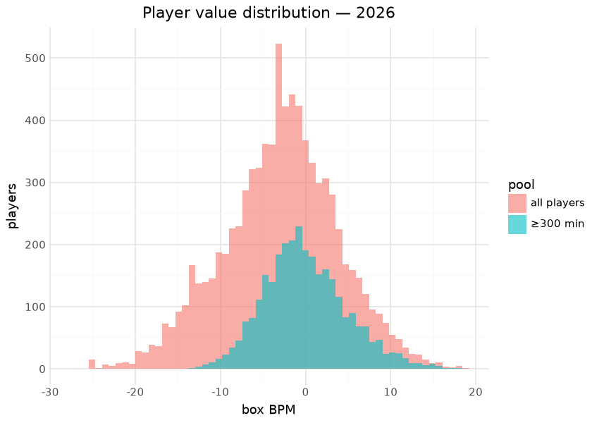
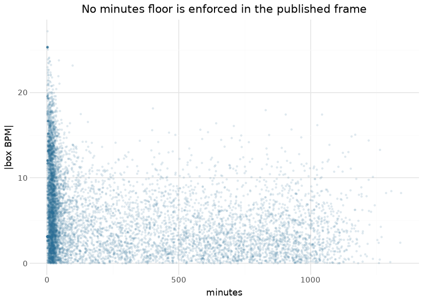

# WBB player value — box Plus/Minus

Per-player box Plus/Minus publishes on the `wbb_player_value` tag
(`box_obpm` / `box_dbpm` / `box_bpm`): a box-score value model over the
published player/team season stats, sharing the design of the WBB
player-value spine in sdv-py (oracle-gated where trained). Box-score
features are regressed onto team-level results to apportion value;
offensive and defensive components are estimated separately and summed.
It is compute-on-demand — every run recomputes from the current
published season assets, so a data correction upstream flows through on
the next publish, and each publish writes a card sidecar.

Box Plus/Minus and on/off RAPM (the `ncaa_wbb_rapm` model in the NCAA
hoops repos) deliberately measure different things: BPM sees only what
reaches the box score and is therefore stable at small samples but blind
to screening, defensive attention, and everything else the box misses;
RAPM sees all of it but drowns in noise for low-minute players. The two
are cross-references, not substitutes — the natural hybrid (an SPM-prior
RAPM, as the NBA impact suite builds) is the catalogued next step.

Everything below is computed at render time from the published release
assets — the exact frames consumers download.

## Training data

| Published wbb_player_value assets, by season |  |  |  |
|----|----|----|----|
| computed at render time from the release |  |  |  |
| season | players | total_minutes | players_300min |
| 2020 | 6811 | 2,190,577 | 2814 |
| 2021 | 5522 | 1,540,568 | 2248 |
| 2022 | 7410 | 2,217,684 | 2899 |
| 2023 | 7289 | 2,340,580 | 2981 |
| 2024 | 7746 | 2,373,446 | 3008 |
| 2025 | 7841 | 2,264,711 | 2920 |
| 2026 | 8305 | 2,426,836 | 3012 |

&#10;

## Exploratory data analysis

The minutes-vs-\|BPM\| funnel is this model’s most important
consumer-facing fact, shown rather than footnoted: the published frame
enforces **no minutes floor**, so the most extreme values in the file
belong to 20-minute seasons. Every table below applies a floor;
consumers must too.

## Attribution

The model is a linear apportionment of team results onto box-score
features, so the published O/D columns are its native attribution — the
scatter above is the decomposition. The fitted coefficient vector lives
with the engine in sdv-py (oracle-gated where trained) rather than in
the published asset; surfacing it alongside the release is listed in the
avenues below.

## Evaluation

| Published-asset checks |  |  |
|----|----|----|
| YoY reliability is the box model's core virtue; a near-zero O/D correlation means the components carry distinct information |  |  |
| check | pairs | pearson |
| box BPM year-over-year (same player, ≥300 min both seasons) | 9651 | 0.822 |
| corr(box_obpm, box_dbpm) — 2026, ≥300 min | 3012 | −0.054 |

&#10;

A box model’s justification is exactly this reliability: with
roster-level churn as violent as college basketball’s, a player metric
that persists season-over-season for returning players is measuring the
player. The engine’s own oracle gates (against the sdv-py player-value
spine’s references) run where the model is trained.

## Results

| Top 15 box BPM — 2026 (min 300 minutes) |  |  |  |  |  |  |
|----|----|----|----|----|----|----|
|  | Player | Team | Min | O-BPM | D-BPM | BPM |
|  | Jana El Alfy | UConn Huskies | 402 | 6.70 | 11.43 | 18.13 |
|  | Kyla Oldacre | Texas Longhorns | 830 | 10.39 | 7.54 | 17.92 |
|  | Madina Okot | South Carolina Gamecocks | 906 | 10.56 | 6.86 | 17.41 |
|  | Sarah Strong | UConn Huskies | 1,044 | 15.80 | 1.61 | 17.41 |
|  | ZaKiyah Johnson | LSU Tigers | 642 | 10.97 | 5.41 | 16.38 |
|  | Lauren Betts | UCLA Bruins | 1,026 | 15.34 | 0.83 | 16.17 |
|  | Amiya Joyner | LSU Tigers | 709 | 8.22 | 7.86 | 16.07 |
|  | KK Arnold | UConn Huskies | 928 | 5.01 | 10.66 | 15.67 |
|  | Kate Koval | LSU Tigers | 582 | 8.37 | 7.27 | 15.64 |
|  | Anaya Hardy | Louisville Cardinals | 399 | 9.09 | 6.49 | 15.58 |
|  | Grace Knox | LSU Tigers | 611 | 9.59 | 5.76 | 15.35 |
|  | Mir McLean | Maryland Terrapins | 463 | 6.90 | 8.39 | 15.29 |
|  | Kiki Rice | UCLA Bruins | 1,170 | 10.85 | 4.21 | 15.05 |
|  | Teya Sidberry | Texas Longhorns | 487 | 5.33 | 9.70 | 15.03 |
|  | Raegan Beers | Oklahoma Sooners | 843 | 13.33 | 1.70 | 15.02 |

&#10;

## Provenance & reproducibility

- **Computed from:** this repository’s published player/team season
  stats for the seasons in the corpus table; recomputed in full on every
  run (compute-on-demand — no fitted artifact is stored).
- **Engine:** the WBB player-value spine in sdv-py (oracle-gated where
  trained); O/D estimated separately and summed.
- **Pipeline:** `scripts/wbb_models.sh 02` → stage
  `python/wbb_model_02_player_value.py`; card sidecar
  [`wbb_models_eval_card.json`](wbb_models_eval_card.json). Single home:
  `models/manifest.yaml`.
- **Rebuild this document:** `scripts/render_model_docs.sh` (Quarto →
  GFM; `uv sync --group docs`). Requires network for the release
  download and the ESPN headshot CDN.

## Avenues for improvement & open issues

- **Blend with on/off** — box Plus/Minus and the league-wide RAPM
  measure different things; a stabilized hybrid (SPM-prior RAPM, as the
  NBA impact suite does) is the natural next step.
- **Ship the coefficient vector** — publishing the fitted coefficients
  (or a per-retrain meta sidecar) would let this document show real
  coefficient importance instead of pointing at the engine.
- **Known issue:** no minutes floor is enforced in the published frame —
  consumers must filter low-minute noise themselves (the funnel figure
  above is the demonstration).
