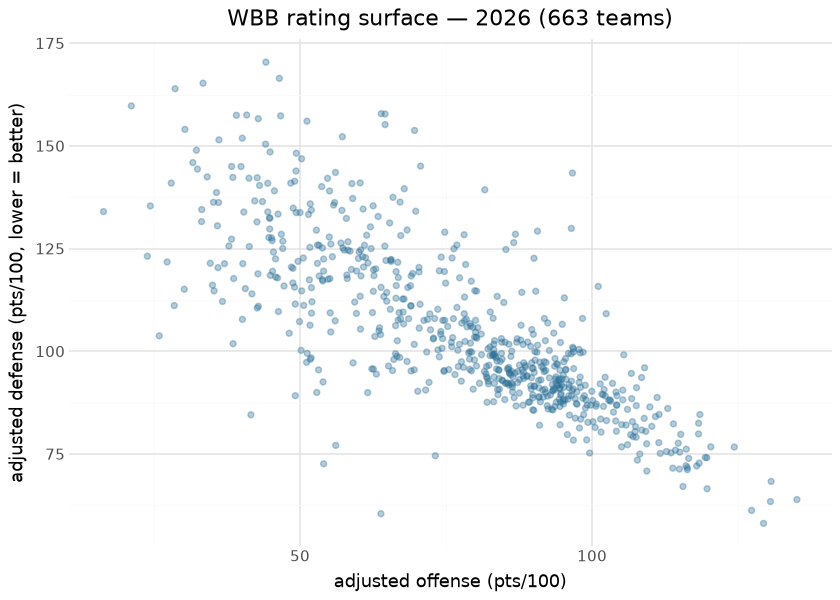
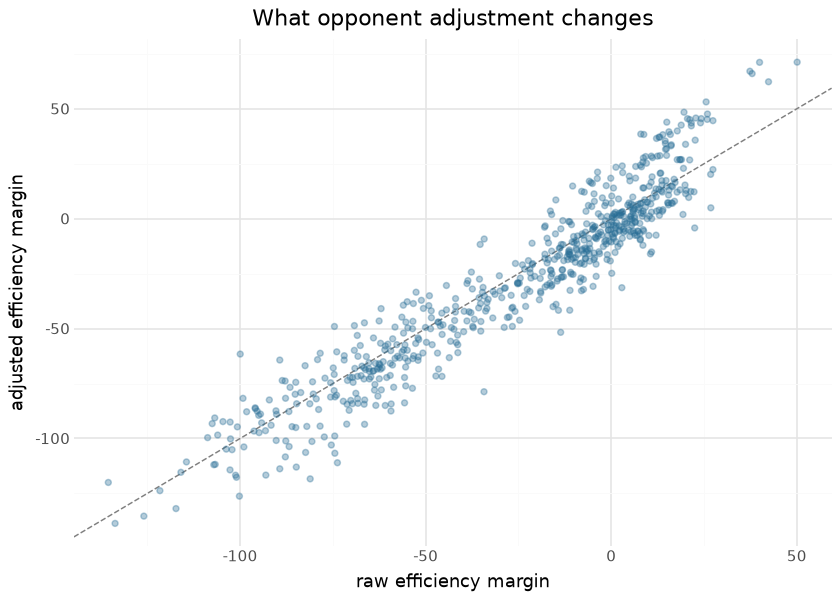

# WBB opponent-adjusted team ratings

Per-season opponent-adjusted team ratings publish on the `wbb_ratings`
release tag: offensive and defensive efficiency (`adj_o` / `adj_d`,
points per 100 possessions) adjusted for opponent quality, plus adjusted
tempo, a net rating (`adj_em`), and its z-score. The engine is the
sdv-py WBB prediction stack’s iterative opponent adjustment — the
em-scale fixed-point solver — so a team’s number reflects who it played,
not just what it scored. Ratings are recomputed from scratch (not
incrementally updated) on every run, so late corrections to the
underlying published pbp/box data propagate automatically.

The model deliberately has no hidden machinery to explain: it is a
fixed-point solve over the season-to-date game matrix. Its “features”
are the game results themselves, its attribution is the O/D
decomposition it publishes, and its verification is external — the
engine’s oracle gates in sdv-py hold the season ordering against
KenPom/Torvik-class references where they are trained. What this
document adds is the render-time view of the published assets a consumer
actually downloads: internal-consistency checks, the structure of the
rating surface, identified team-level results, and the absolute level
gate that guards the scale a rank check cannot see.

## Training data

| Published wbb_ratings assets, by season |  |  |  |  |  |
|----|----|----|----|----|----|
| the full frame carries every opponent ever seen (few-game non-D1 teams pull its mean far negative); the core -- teams with 10+ games -- sits near zero |  |  |  |  |  |
| season | teams | teams_10plus_games | team_games | mean_adj_em_all | mean_adj_em_core |
| 2008 | 354 | 158 | 3,522 | −11.87 | 3.12 |
| 2009 | 343 | 71 | 2,590 | −21.19 | 11.51 |
| 2010 | 301 | 66 | 1,850 | −23.98 | 7.50 |
| 2011 | 240 | 45 | 1,462 | −24.82 | 9.41 |
| 2012 | 336 | 78 | 2,884 | −20.75 | 9.33 |
| 2013 | 348 | 101 | 3,662 | −13.05 | 6.97 |
| 2014 | 340 | 83 | 3,444 | −16.42 | 7.26 |
| 2015 | 335 | 78 | 3,186 | <na> | <na> |
| 2016 | 345 | 84 | 3,584 | −15.54 | 7.70 |
| 2017 | 365 | 349 | 10,484 | −3.49 | −1.23 |
| 2018 | 356 | 349 | 10,566 | −2.65 | −1.19 |
| 2019 | 360 | 351 | 10,732 | −2.35 | −1.17 |
| 2020 | 546 | 351 | 10,852 | −18.16 | 1.00 |
| 2021 | 433 | 333 | 7,646 | −10.77 | −0.83 |
| 2022 | 571 | 356 | 11,024 | −21.14 | 0.70 |
| 2023 | 578 | 361 | 11,630 | −20.99 | 0.59 |
| 2024 | 621 | 360 | 11,796 | −23.76 | 0.84 |
| 2025 | 618 | 362 | 11,252 | −23.44 | 0.78 |
| 2026 | 663 | 363 | 12,058 | −27.82 | 1.35 |

&#10;

Inputs are the published season pbp/box assets of this repository — the
ratings sit downstream of the same daily pipeline that publishes the
data they are computed from, which is what keeps them reproducible. A
season row whose means are blank is a published asset the fixed point
never converged on (every rating NaN); the level gate below now refuses
such a season at publish time.

## Exploratory data analysis

| Internal consistency — 2026                      |        |
|--------------------------------------------------|--------|
| check                                            | value  |
| mean adj_em, teams with 10+ games (should be ~0) | 1.3497 |
| corr(adj_em, raw margin)                         | 0.9496 |
| corr(adj_em, adj_em_z) (should be ~1)            | 1.0000 |

&#10;

The vertical spread between raw and adjusted margin is the point of the
model: mid-major teams with gaudy raw margins move down,
power-conference teams with brutal schedules move up, and the
correlation between the two — strong but visibly below 1 — is the honest
measure of how much schedule matters in a 360+ team league where most
games are intra-tier.

## Evaluation

The engine’s publish gates live in sdv-py where it is trained (external
ordering checks against reference systems; the NCAA RAPM repos hold the
same family of engines to Torvik at Spearman ≥ 0.93). At the asset
level, the render-time check available without an external feed is
**predictive consistency**: within a season, adj_em should order
head-to-head margins better than raw margin does, and across seasons a
program’s rating should be sticky. The cross-season stability computed
from the published assets:

| Program stickiness — adj_em season S vs S+1, same team |  |  |
|----|----|----|
| published-asset check; programs are persistent, rosters are not — the gap is roster turnover |  |  |
| season | yoy_pearson | teams |
| 2008 | 0.729 | 332 |
| 2009 | 0.656 | 291 |
| 2010 | 0.613 | 226 |
| 2011 | 0.686 | 235 |
| 2012 | 0.729 | 330 |
| 2013 | 0.765 | 334 |
| 2014 | <na> | 317 |
| 2015 | <na> | 323 |
| 2016 | 0.803 | 344 |
| 2017 | 0.870 | 353 |
| 2018 | 0.881 | 351 |
| 2019 | 0.836 | 355 |
| 2020 | 0.878 | 376 |
| 2021 | 0.887 | 390 |
| 2022 | 0.900 | 472 |
| 2023 | 0.905 | 484 |
| 2024 | 0.886 | 496 |
| 2025 | 0.892 | 519 |

&#10;

## Level gate — the scale check a rank gate cannot do

Spearman is invariant to a **common strictly increasing** rescale:
multiply every rating by 100, or divide them all by the same constant,
and the rank correlation against KenPom or Torvik does not move. That is
how a ratings scale bug ships past a rank-only gate (it happened in this
ecosystem’s CFB ratings). Two errors it *does* see: a sign flip reverses
the order, so a positive rank correlation turns negative, and dividing
each team by its OWN games count is not a common transform, so it can
reorder teams too. The rank gate is the sign-and-order check; the level
gate is what catches an absolute-scale error that leaves the order alone
– a sign flip of a small mean `adj_em` lands well inside the band, so
neither gate is redundant. The publish path of this repository therefore
carries an **absolute level gate** beside the engine’s rank gates: over
the core — teams with at least `MIN_GAMES_GATED` games — the season’s
mean `adj_o`, `adj_d`, `adj_em` and `adj_tempo` and the spread of
`adj_em` must sit inside bands set from the observed published seasons
and in-season snapshots, with no non-finite value; it applies once
`MIN_GATED_TEAMS` teams qualify and logs, rather than pretends, before
that. The table is the gate re-run at render time on the assets
consumers download.

| Level gate re-run on the published assets (teams with 10+ games; applies at 150+ such teams) |  |  |  |  |  |  |  |  |
|----|----|----|----|----|----|----|----|----|
| bands: mean adj_o in \[85, 105\], mean adj_d in \[80, 100\], mean adj_em in \[-12, 12\], mean adj_tempo in \[64, 78\], sd adj_em in \[14, 28\] |  |  |  |  |  |  |  |  |
| season | core_teams | non_finite | mean_adj_o | mean_adj_d | mean_adj_em | mean_adj_tempo | sd_adj_em | verdict |
| 2008 | 158 | 0 | 119.37 | 116.26 | 3.12 | 54.52 | 23.30 | REFUSED: out of band |
| 2009 | 71 | 0 | 122.97 | 111.47 | 11.51 | 54.35 | 15.90 | not applied (too few core teams) |
| 2010 | 66 | 0 | 120.52 | 113.02 | 7.50 | 55.09 | 16.14 | not applied (too few core teams) |
| 2011 | 45 | 0 | 123.13 | 113.72 | 9.41 | 55.57 | 16.06 | not applied (too few core teams) |
| 2012 | 78 | 0 | 119.75 | 110.41 | 9.33 | 54.59 | 18.23 | not applied (too few core teams) |
| 2013 | 101 | 0 | 91.85 | 84.88 | 6.97 | 70.77 | 14.94 | not applied (too few core teams) |
| 2014 | 83 | 0 | 98.79 | 91.52 | 7.26 | 71.30 | 12.57 | not applied (too few core teams) |
| 2015 | 78 | 78 | <na> | <na> | <na> | <na> | <na> | REFUSED: non-finite ratings |
| 2016 | 84 | 0 | 96.88 | 89.18 | 7.70 | 70.33 | 13.47 | not applied (too few core teams) |
| 2017 | 349 | 0 | 91.86 | 93.09 | −1.23 | 69.90 | 19.00 | pass |
| 2018 | 349 | 0 | 93.04 | 94.23 | −1.19 | 70.00 | 18.91 | pass |
| 2019 | 351 | 0 | 92.01 | 93.18 | −1.17 | 70.24 | 19.10 | pass |
| 2020 | 351 | 0 | 92.20 | 91.20 | 1.00 | 70.79 | 18.12 | pass |
| 2021 | 333 | 0 | 92.12 | 92.96 | −0.83 | 70.67 | 20.08 | pass |
| 2022 | 356 | 0 | 91.88 | 91.18 | 0.70 | 70.12 | 18.53 | pass |
| 2023 | 361 | 0 | 92.56 | 91.97 | 0.59 | 70.35 | 19.66 | pass |
| 2024 | 360 | 0 | 92.97 | 92.12 | 0.84 | 70.39 | 19.95 | pass |
| 2025 | 362 | 0 | 93.04 | 92.27 | 0.78 | 70.41 | 20.73 | pass |
| 2026 | 363 | 0 | 93.15 | 91.80 | 1.35 | 70.82 | 21.03 | pass |

&#10;

The bands were set on 2026-09-01 from the published 2017–2026 assets —
the full-coverage era — plus in-season engine snapshots (2024, 2025 and
2026 from Dec 10 to season end): core teams 333–363 at season end and
151+ from about Dec 10–20; mean adj_o 91.9–97.6; mean adj_d 86.95–94.2;
mean adj_em −1.2 to 10.6 (the high end is mid-December, when the core is
small and unbalanced; ≤ 1.4 at season end); sd adj_em 18.1–23.1; mean
adj_tempo 69.9–72.6. Each band is the observed range padded so a real
season never trips it while a unit or scale error does — per-game
instead of per-100 divides every level by ~1.5, a sign flip mirrors
adj_em, and an un-converged fixed point (the published 2015 asset, every
team NaN) fails the finiteness check.

Two archive-era consequences are deliberate, and are recorded rather
than papered over by widening the band. The 2008 asset sits on a
different scale (158 core teams, mean adj_o 119.4, mean adj_tempo 54.5 —
the pre-2013 box schema under-counts possessions) and is **refused**;
2009–2016 carry 45–101 core teams, below the applicability floor, so the
gate reports that it did not apply rather than pretending to. Both are
inputs to repair, not reasons to lower a gate.

## Results

| Top 25 — 2026 adjusted ratings |  |  |  |  |  |  |  |
|----|----|----|----|----|----|----|----|
|  | Team | Rk | AdjO | AdjD | AdjEM | AdjT | G |
|  | UConn Huskies | 1 | 129.3 | 58.1 | 71.2 | 72.9 | 39 |
|  | UCLA Bruins | 2 | 135.1 | 63.9 | 71.1 | 68.2 | 38 |
|  | South Carolina Gamecocks | 3 | 130.5 | 63.4 | 67.1 | 71.9 | 40 |
|  | Texas Longhorns | 4 | 127.3 | 61.3 | 66.0 | 71.8 | 39 |
|  | LSU Tigers | 5 | 130.6 | 68.4 | 62.3 | 77.0 | 35 |
|  | Michigan Wolverines | 6 | 119.7 | 66.6 | 53.1 | 74.7 | 35 |
|  | Duke Blue Devils | 7 | 115.6 | 67.1 | 48.4 | 71.4 | 36 |
|  | Vanderbilt Commodores | 8 | 124.3 | 76.7 | 47.6 | 72.8 | 34 |
|  | Minnesota Golden Gophers | 9 | 117.9 | 72.1 | 45.8 | 68.0 | 33 |
|  | Louisville Cardinals | 10 | 119.7 | 74.1 | 45.5 | 71.3 | 37 |
|  | Kentucky Wildcats | 11 | 118.3 | 72.8 | 45.5 | 68.8 | 36 |
|  | Maryland Terrapins | 12 | 119.4 | 74.2 | 45.2 | 74.0 | 33 |
|  | Oklahoma Sooners | 13 | 116.3 | 71.2 | 45.1 | 79.6 | 34 |
|  | TCU Horned Frogs | 14 | 116.3 | 71.7 | 44.6 | 69.4 | 38 |
|  | Iowa Hawkeyes | 15 | 116.1 | 72.2 | 43.9 | 72.2 | 34 |
|  | West Virginia Mountaineers | 16 | 114.9 | 71.3 | 43.6 | 71.5 | 35 |
|  | Michigan State Spartans | 17 | 120.3 | 76.8 | 43.5 | 72.8 | 32 |
|  | Ohio State Buckeyes | 18 | 116.5 | 74.0 | 42.6 | 75.7 | 35 |
|  | North Carolina Tar Heels | 19 | 113.8 | 71.6 | 42.2 | 70.8 | 36 |
|  | Ole Miss Rebels | 20 | 116.1 | 76.2 | 39.9 | 69.8 | 36 |
|  | Notre Dame Fighting Irish | 21 | 115.0 | 75.5 | 39.5 | 72.6 | 36 |
|  | USC Trojans | 22 | 109.4 | 70.9 | 38.5 | 71.8 | 32 |
|  | Tennessee Lady Volunteers | 23 | 114.3 | 76.0 | 38.3 | 74.9 | 30 |
|  | Nebraska Cornhuskers | 24 | 118.2 | 79.9 | 38.3 | 71.2 | 32 |
|  | Washington Huskies | 25 | 113.5 | 75.3 | 38.2 | 69.0 | 33 |

&#10;

## Provenance & reproducibility

- **Computed from:** this repository’s published season pbp/box assets,
  seasons listed in the corpus table; recomputed in full on every run.
- **Engine:** the sdv-py WBB prediction stack’s iterative opponent
  adjustment (em-scale fixed point); engine training + oracle (rank)
  gates live in sdv-py.
- **Level gate:**
  `python/wbb_model_publish/builders.py::assert_ratings_level` (bands,
  floor and observations recorded in `models/REGISTRY.md`); its
  per-season record is written into the `wbb_ratings_card.json` sidecar.
- **Pipeline:** `scripts/wbb_models.sh 01` → stage
  `python/wbb_model_01_ratings.py` (wired via `wbb_models_cron.yml`);
  each publish writes a card sidecar
  ([`wbb_models_eval_card.json`](wbb_models_eval_card.json)). Single
  home: `models/manifest.yaml`.
- **Rebuild this document:** `scripts/render_model_docs.sh` (Quarto →
  GFM; `uv sync --group docs`). Requires network for the release
  download and the logo CDN.

## Avenues for improvement & open issues

- **Preseason priors** — blend the recruiting/returning-production prior
  into early-season ratings instead of starting from a flat matrix.
- **Home/travel modeling** — altitude and travel distance are unmodeled.
- **Resolved (2026-09-01, PR \#32):** the scale-blindness of the
  Spearman-style checks is closed in this repository by the absolute
  level gate above (`assert_ratings_level`), run at publish beside
  sdv-py’s rank gates and re-run on the published assets in this
  document.
- **Known issue:** the published `wbb_ratings_2015.parquet` is entirely
  NaN (335/335 teams; the fixed point did not converge on that season’s
  inputs), which is also what makes every 2015 row of `wbb_player_value`
  NaN. The level gate refuses it, so the repair is upstream in the
  engine/inputs, then a republish.
- **Known issue:** the 2008–2016 archive seasons have thin `team_box`
  coverage (45–158 teams with 10+ games) and the pre-2013 seasons sit on
  a different possession scale; they are published but sit outside (or
  below) the level gate’s applicability.
