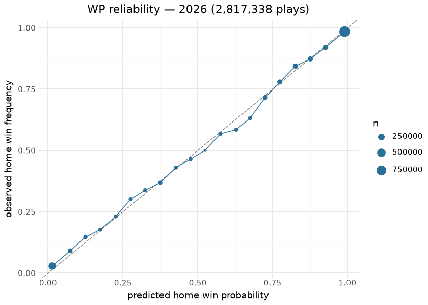
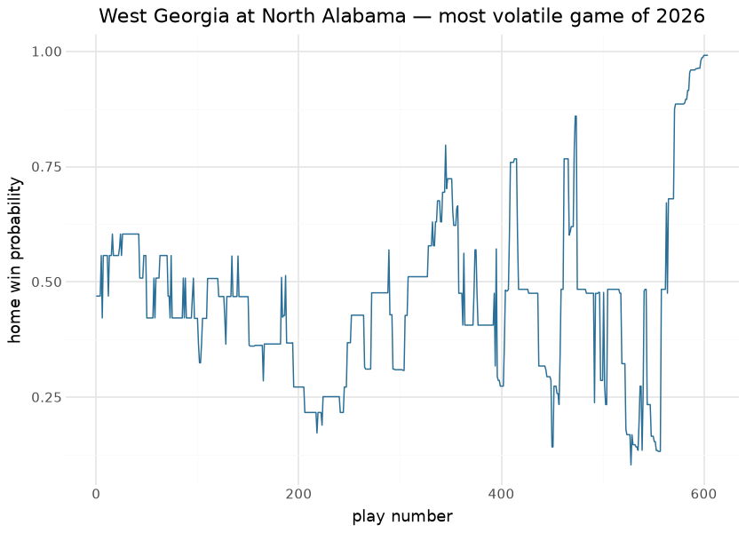
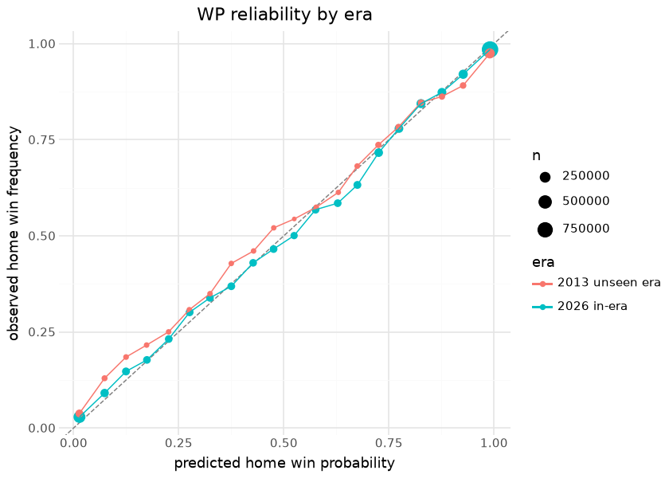

# WBB in-game win probability — pbp enrichment

The WBB rule-era win-probability suite (trained, bundled, and
oracle-gated in sdv-py) is applied **in place** to every published
season of `espn_womens_college_basketball_pbp`: `home_win_prob` and the
pregame prior (`pregame_home_prob`) are added to each play with every
original column preserved. The published pbp itself is how the model
reaches consumers — there is no separate WP asset to fall out of sync
with the plays.

The model is an XGBoost classifier over game state — score margin,
seconds left (and its square root), the pregame logit, and possession —
fit on one recent season. Operationally the enrichment **is** the pbp
publisher: `scripts/daily_wbb_data_processor.sh` builds the plain season
pbp into the tree and never uploads it; stage `wbb_model_03_wp_enrich`
reads the tree pbp/schedules/team_box, appends the two columns and
publishes parquet+csv+rds; and `wbb_data_build.publish` refuses any pbp
parquet without finite WP columns, asserted on the file about to upload.
That design closes a recorded incident: the old
publish-plain-then-re-enrich order stripped the columns off the release
on every nightly, and the 2026-08 whole-history republish left only the
in-season seasons enriched — measured 2026-09-01, 2024–2026 carry the
columns and every earlier season sampled (2004, 2008, 2012, 2015, 2016,
2020) does not. Until those seasons are republished, this document
computes the holdout era’s probabilities itself and says so.

This document is the model’s **out-of-band evaluation**: it downloads a
full published season at render time and holds the in-game probabilities
against each game’s realized outcome — first in-era, then for an era the
booster never saw. If the enrichment ever regressed, went stale, or was
stripped, the calibration sections below would show it on the next
render.

## Evaluation data

| Published season evaluated at render time — 2026 |  |  |  |  |
|----|----|----|----|----|
| every play of the published pbp joined to its game's realized outcome (ties from data artifacts excluded) |  |  |  |  |
| season | enriched_plays | games | home_win_rate | mean_home_win_prob |
| 2026 | 2,817,338 | 5998 | 62.3% | 0.6266 |

&#10;

The mean predicted probability sitting close to the realized home-win
rate is the zeroth-order calibration check; the college home floor is
one of the strongest in sports and both numbers reflect it.

## Calibration

| Out-of-band calibration — 2026 published season         |        |
|---------------------------------------------------------|--------|
| metric                                                  | value  |
| Brier score (all plays)                                 | 0.1045 |
| 20-bin calibration MAE                                  | 0.0143 |
| baseline Brier (constant = play-weighted home-win rate) | 0.2341 |

&#10;

| Brier by period — uncertainty should resolve as the game progresses |  |  |
|----|----|----|
| a well-behaved WP model gets sharper (lower Brier) in later periods |  |  |
| period_number | plays | brier |
| 1 | 655,639 | 0.1478 |
| 2 | 693,809 | 0.1219 |
| 3 | 709,816 | 0.0952 |
| 4 | 739,209 | 0.0571 |
| 5 | 16,120 | 0.1649 |

&#10;

| Pregame vs in-game — the value the enrichment adds over the prior |        |
|-------------------------------------------------------------------|--------|
| model                                                             | brier  |
| pregame prior (one prob per game)                                 | 0.1638 |
| in-game WP (all plays)                                            | 0.1045 |

&#10;

The reliability diagram hugging the diagonal, the per-period Brier
falling monotonically, and the in-game model beating its own pregame
prior are the three signatures of a healthy applied WP surface. The
volatile-game trace is the demonstration consumers care about: the
column tells the story of a comeback without any narrative input.

## Unseen-era holdout

Holdout season **2013** — 627,477 plays in 1,857 games; probabilities
computed at render time – the release asset lacks the WP columns.

| Era transfer — the same booster in-era and on an era it never saw |  |  |  |  |  |  |
|----|----|----|----|----|----|----|
| the calibration-MAE gap between the rows is the era-transfer error, bounded here rather than assumed |  |  |  |  |  |  |
| era | plays | brier | baseline_brier | skill_vs_baseline | calibration_mae_20bin | pregame_brier |
| 2026 (in-era) | 2,817,338 | 0.1045 | 0.2341 | 55.4% | 0.0143 | 0.1638 |
| 2013 (unseen: halves era, before the 2016 move to quarters) | 627,477 | 0.1136 | 0.2313 | 50.9% | 0.0273 | 0.1815 |

&#10;

The booster sees only game state, so what an unseen era tests is whether
“down 6 with 4:00 left” meant the same thing when the game was played in
two halves rather than four quarters. The table bounds that explicitly:
the skill-versus-baseline and calibration MAE of the old era sit next to
the in-era numbers rather than being assumed equal. The pregame prior
also moves across eras — it is an as-of team-rating model over that
season’s own results — so the holdout tests the whole applied surface,
not just the tree.

## Provenance & reproducibility

- **Model:** XGBoost in-game WP over game state (score margin, seconds
  left, its square root, pregame logit, possession), fit on one recent
  season, bundled and oracle-gated in sdv-py
  (`wbb/models/wbb_in_game_wp.ubj`). WBB play-by-play is **halves before
  season 2016**; the game-state features are period-agnostic, and the
  holdout section above is what bounds the transfer across that change
  instead of assuming it.
- **Applied to:** every published season of
  `espn_womens_college_basketball_pbp`, in place, columns
  `home_win_prob` + `pregame_home_prob`, by the enrichment stage — the
  pbp asset’s only publisher.
  `wbb_data_build.publish.assert_wp_enriched` refuses any pbp parquet
  missing the columns or below a 0.999 finite-rate floor (observed 1.0
  on 2024–2026), asserted on the file about to upload.
- **Pipeline:** `scripts/wbb_models.sh 03` → stage
  `python/wbb_model_03_wp_enrich.py -s <season> -e <season>`, wired at
  the end of `scripts/daily_wbb_data_processor.sh` (after schedules +
  team_box exist in the tree). Single home: `models/manifest.yaml`.
- **Release state (2026-09-01):** 2024–2026 carry the columns; every
  earlier season sampled (2004, 2008, 2012, 2015, 2016, 2020) does not
  and needs one `wbb_model_03_wp_enrich -s 2003 -e 2023` republish. This
  document falls back to computing the holdout era itself while that is
  outstanding.
- **This document** evaluates two published seasons downloaded at render
  time (~90 MB + ~50 MB) — the exact frames consumers read.
- **Rebuild:** `scripts/render_model_docs.sh` (Quarto → GFM;
  `uv sync --group docs`).

## Avenues for improvement & open issues

- **Possession-state features** — foul counts, bonus state, and timeout
  inventory are absent from the WP inputs.
- **Resolved (2026-09-01, PR \#32):** the nightly publish no longer
  strips the WP columns — the enrichment stage is the pbp asset’s only
  publisher and the publish path refuses an un-enriched pbp parquet, so
  no publish window exists in which a season lacks WP. The pre-2024
  seasons stripped by the history republish still need the one-off
  republish listed above.
- **Resolved (2026-09-01, PR \#32):** season-holdout curve — the
  unseen-era section above renders the same calibration for a season the
  booster never saw and reports the era-transfer error as a number.
