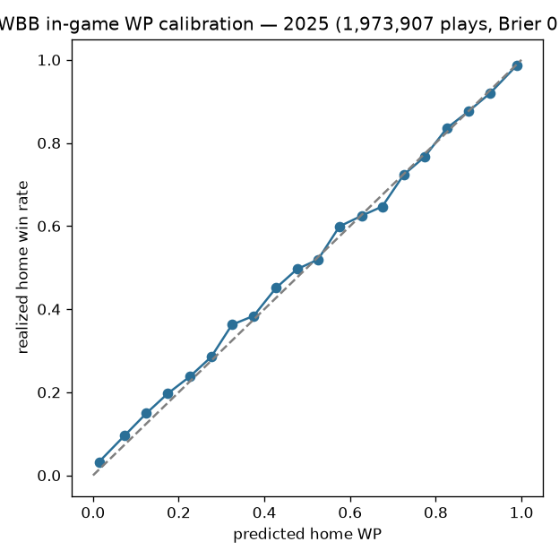

# WBB in-game win probability (pbp enrichment)

## Overview

The WBB rule-era WP suite (trained, bundled, and oracle-gated in sdv-py) is
applied IN PLACE to every published season of `espn_womens_college_basketball_pbp`: `home_win_prob` (and
the pregame prior) are added to each play, every original column preserved.
The published pbp itself is how the model reaches consumers.

## Methodology

Rule-era XGBoost WP models over game state (score margin, time, possession);
era-specific boosters absorb rule changes across the 2003-2026 span. The
enrichment runs post-publish in `scripts/daily_wbb_data_processor.sh`
because the nightly publish otherwise silently strips the WP columns — that
incident is why the stage exists and why re-application is unconditional.

## Evaluation

### WP enrichment calibration (2025)

1,973,907 enriched plays from the published pbp: Brier **0.1059**, 20-bin calibration MAE **0.0144** (predicted `home_win_prob` vs the game's realized outcome — a real out-of-band check of the applied model).

This is a genuine out-of-band check: the calibration compares the applied
model's in-game probabilities against each game's realized outcome across the
full published season.

## Reproducibility

`scripts/wbb_models.sh 03` → `python/wbb_model_03_wp_enrich.py -s <season> -e <season>`.

## Limitations

The WP model sees score/time/possession state, not personnel or foul trouble;
very early-season priors lean on the pregame model's inputs.

## Avenues for improvement & open issues

- **Possession-state features** — foul counts, bonus state, and timeout
  inventory are absent from the WP inputs.
- **Known issue (recorded incident):** the nightly publish silently strips WP
  columns, which is why re-application is unconditional — moving enrichment
  INTO the publish step would remove the failure mode instead of patching it.
